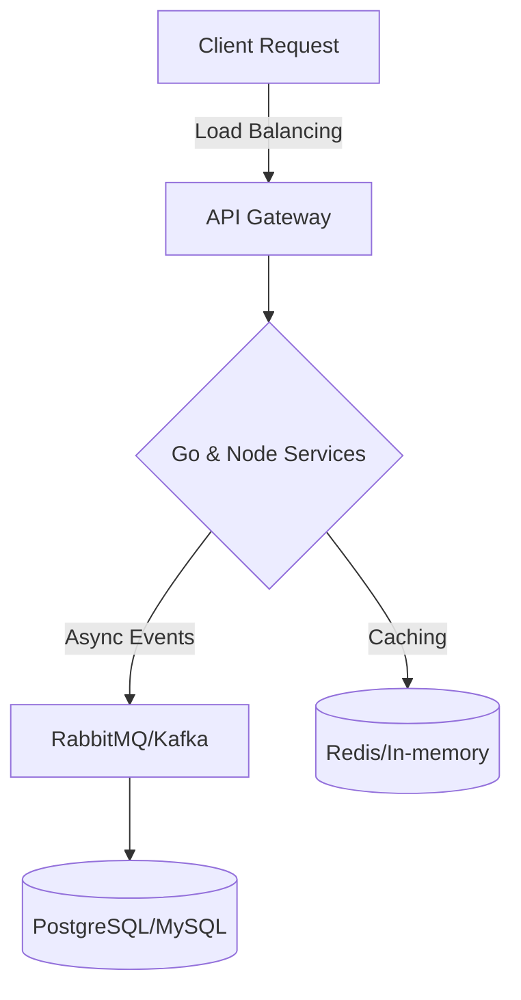

# Eduardo Müller | Software Engineer

> Focused on high-performance systems, distributed architectures, and algorithmic efficiency. 
> Committed to Big O optimization, memory safety, and high-quality technical documentation.

---

### 📈 Current Engineering Focus (2026)
- 🛠 **System Design:** Studying Distributed Consensus algorithms (Raft/Paxos).
- 🚀 **Performance:** Benchmarking Node.js vs Go in high-load scenarios.
- 🧪 **Reliability:** Implementing Chaos Engineering principles in microservices.

---

### 🛠 Technical Proficiency

| Layer | Technologies | Engineering Focus |
| :--- | :--- | :--- |
| **Languages** | C, Go, Node.js, TS, React | Memory Management, Concurrency, and Resource Optimization |
| **Backend** | Go (Standard Lib/Echo), Node.js (Express), REST | Scalability, Low-latency, High throughput |
| **Infrastructure** | Docker, PostgreSQL, MySQL, Prisma ORM | Data Persistence, Containerization, RDBMS |

---

### 📊 Engineering Metrics & Impact

  
  

---

### 🏗 System Design Strategy

---

### 📫 Connect with me

  
  

---

  Built with precision and high-performance standards. © 2026 Eduardo Müller

